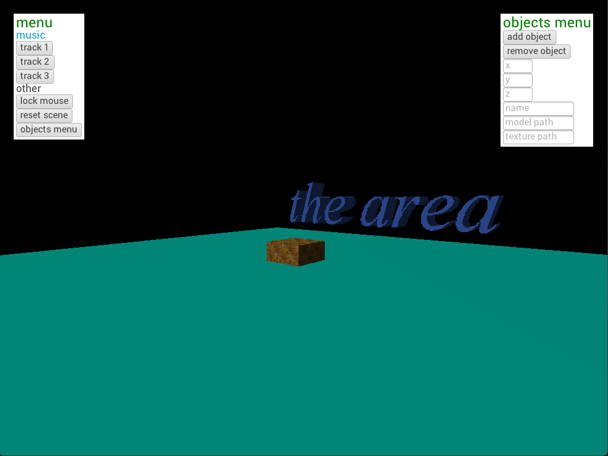

<h1>elisoscelesEngine</h1>
  <h4>internal game engine based on <a href="https://www.lwjgl.org/">LWJGL</a></h4>

  

  

  

  <h3>Structure</h3>
  
The main difference between the new version & the old version is that the scenes system (which is arguably the most important part of a game engine) was based on JavaScript, which was a flawed system for a number of reasons. It was using deprecated libraries, Java.type calls, & was overall a bad way of loading & updating scenes.

   
  
The new version simply uses java classes as Scenes. Java classes are a lot less modifiable & has the issue of having to recompile every time you edit a scene, but in my opinion the pros outweigh the cons.

   
  
In the new version, the scenes systems works through a SceneManager class, which loads Scene classes. There are 3 subtypes of the scene class, StaticScene, RenderedScene, & PhysicalScene. StaticScene is the simplest type of scene. It only allows for UI & images, no 3D. RenderedScene is a scene that allows for OpenGL rendering of .obj files, textures & shaders. The renderer still needs work, such as multitexturing, improved lighting, & more camera types, but the engine is still very unfinished, & i'll add that stuff later. The final scene type is PhysicalScene, which is the exact same as RenderedScene, but with the capability for physics to be added once I get it added. All three scene types make calls to the UIManager & SceneManager which in turn play audio & render objects, which gets displayed on the screen through DisplayManager.

  <h3>Using</h3>
  
The engine is packaged as an intelliJ project, all you have to do is clone the repo, add the lwjgl libraries, open the project in intelliJ, and add the libraries to the project.

  
- Main class

  
  - DisplayManager creates window

  
    - SceneManager loads scene

  
    - SceneManager updates scene, window, & renders scene objects

  
    - SceneManager disposes scene

  
    - DisplayManager closes window

  

  <h3>TO-DO</h3>
  
  - physics (IN PROGRESS)

  
  - Save files

  
  - UI (IN PROGRESS)

  
  - Spatial audio

